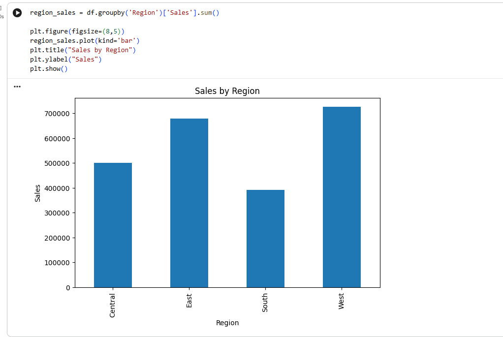
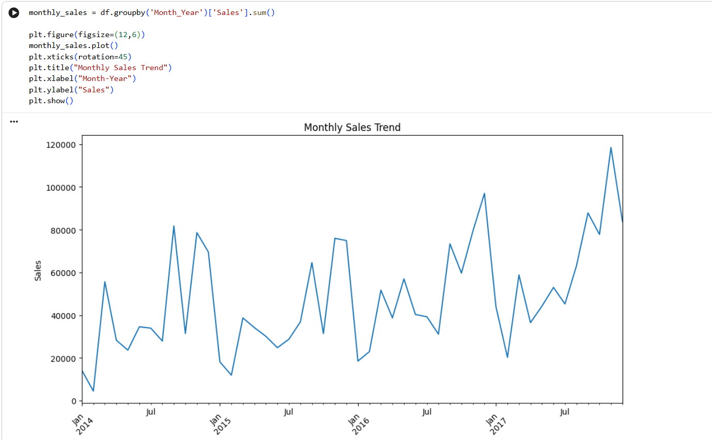
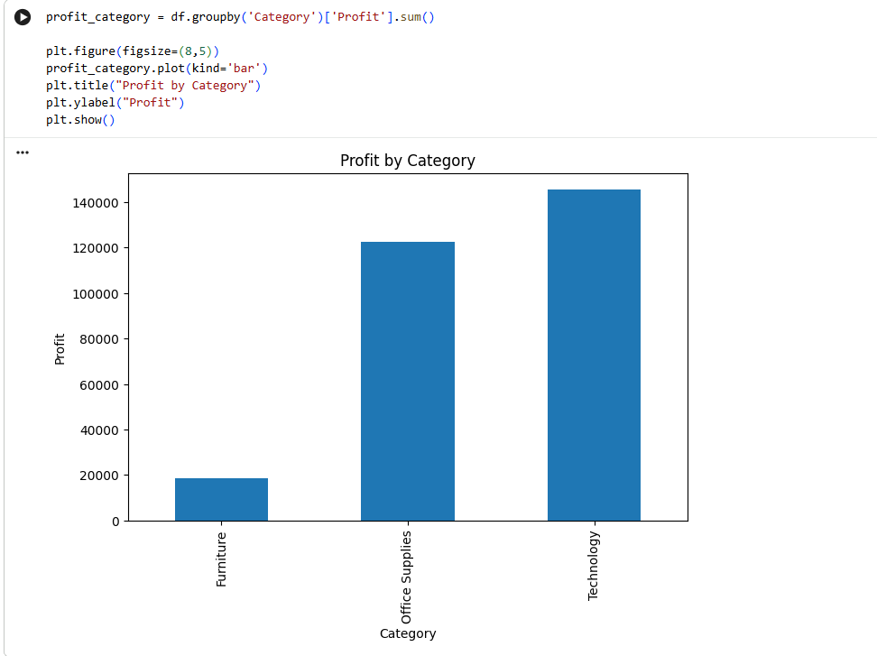
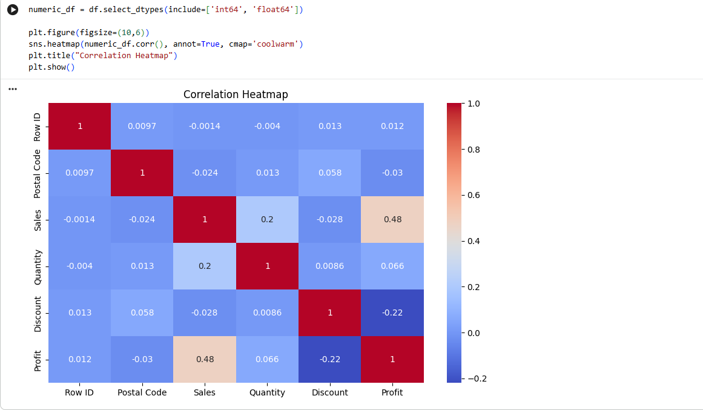
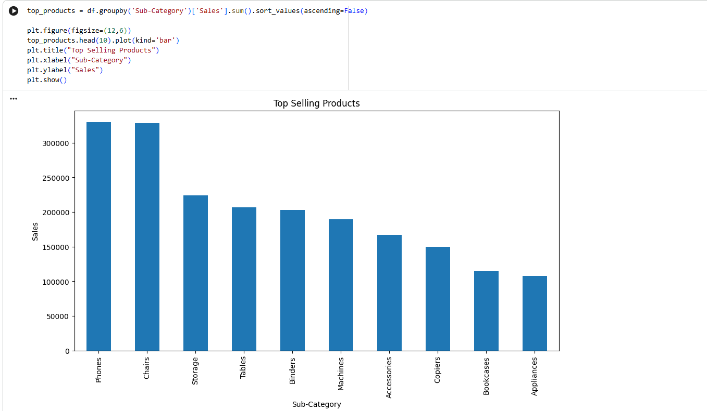

# Sales Data Analysis Internship Project

## Project Title
Sales Data Analysis Internship Task

## Problem Statement
This project analyzes the Sample Superstore dataset to identify sales trends, product performance, and profit drivers. The goal is to provide clear insights that support data-driven business decisions.

## Objective
- Explore sales performance across regions, product categories, and months
- Identify the most profitable products and categories
- Visualize trends and relationships in the dataset
- Provide actionable business insights and recommendations

## Technologies Used
- Python
- Jupyter Notebook
- Pandas
- Matplotlib / Seaborn
- Plotly (optional)
- CSV dataset

## Dataset Information
- Dataset name: `Sample - Superstore.csv`
- Description: A retail dataset containing order, sales, profit, category, and region information for a sample superstore
- Main columns:
  - `Order Date`
  - `Ship Mode`
  - `Region`
  - `Category`
  - `Sub-Category`
  - `Sales`
  - `Profit`
  - `Quantity`

## Workflow
1. Load and inspect the dataset
2. Clean and preprocess the data
3. Analyze sales by region and product category
4. Visualize monthly sales trends
5. Calculate profit contributions by category
6. Derive business insights and recommendations

## Visualizations
### Sales by Region

### Monthly Sales Trend

### Profit by Category

### Correlation Heatmap

### Top Selling Products

## Key Insights
- Some regions outperform others in total sales and profit, showing where demand is strongest.
- Certain categories generate higher revenue and profit, making them priority areas for growth.
- Monthly sales trends reveal seasonality and peak periods for promotions.
- High-profit products can be targeted for inventory and marketing focus.
- Low-profit categories may need pricing or product strategy adjustments.

## Conclusion
This analysis provides a strong view of sales performance and profit drivers in the Sample Superstore dataset. The findings can help stakeholders optimize product selection, regional strategies, and promotions.

## Future Improvements
- Add predictive modeling for sales forecasting
- Include customer segmentation analysis
- Build an interactive dashboard for business users
- Analyze shipping mode impact on sales and profit
